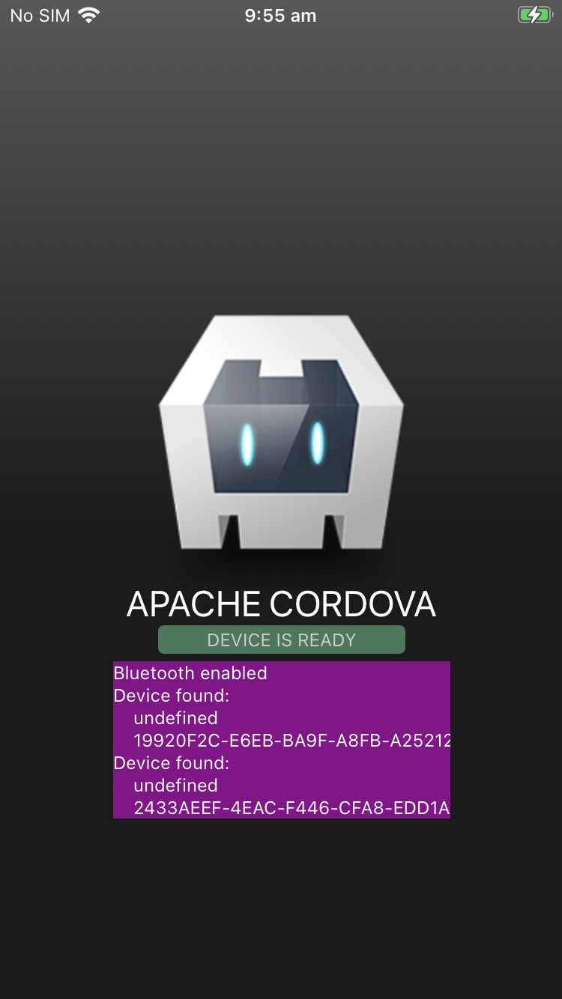

# Demo app for cordova-plugin-ble-central

`cordova` must be installed globally for this to work:
```
npm install -g cordova
```

Download and deploy the app like this:
```
npm ci
cordova prepare ios
cordova run ios --device
```

This demo was created by running these commands:
```
cordova create something
cd something
cordova platform add ios
cordova platform add browser
cordova plugin add cordova-plugin-network-information
cordova plugin add cordova-plugin-ble-central
```


